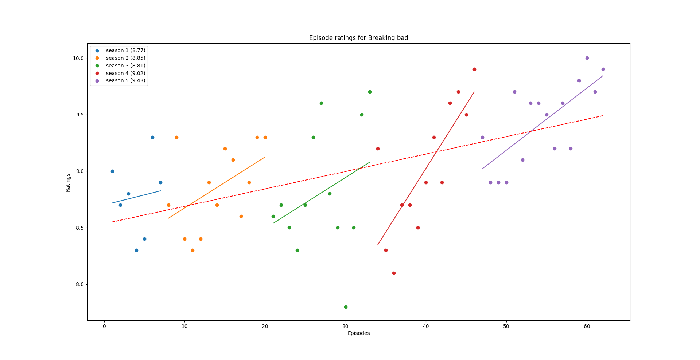

# Episode-Graphs
The code in this repository lets you plot the episode ratings for a series. For example, Breaking Bad:

## Functionality
At the moment, the program is very basic. You can
 - plot the ratings per episode
 - show a trendline for each season
 - show the trendline across all seasons
 
## Usage
An OMDB key is needed to create your own plot. You can generate your own at http://www.omdbapi.com/apikey.aspx. Save it in a file named key.txt in the folder graph.py is in, and you're good to go!
